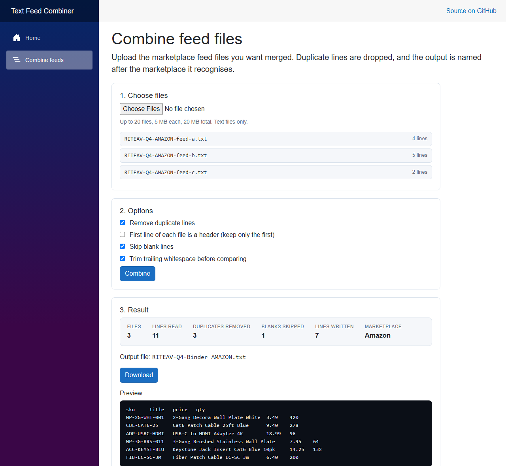

# Text Feed Combiner

Merge several marketplace feed files into one, without the duplicate lines. Upload
the files, pick your options, download the result.



## Stack

- .NET 10, Blazor Server (interactive server rendering)
- xUnit for the domain tests
- No database - this one is about file handling and class design

## What it does

- Combines any number of tab-delimited or plain text feed files
- Drops duplicate lines and reports how many it removed
- Names the output after the marketplace it recognises in the file name
- Optionally treats the first line of each file as a header and keeps only one copy
- Skips blank lines, and trims trailing whitespace so `value` and `value   ` are not
  mistaken for two different rows
- Caps uploads at 20 files, 5 MB each, 20 MB total

## Why it exists: a procedural-to-object-oriented rewrite

This is a rewrite of **MicroCombiner**, a Windows Forms utility I wrote to merge
marketplace feeds. The original is 95 lines, and **every piece of business logic
lives inside a single drag-and-drop event handler** - marketplace detection, output
naming, duplicate removal, and file writing, all interleaved with UI calls:

```csharp
private void Form1_DragDrop(object sender, DragEventArgs e)
{
    string[] files = (string[])e.Data.GetData(DataFormats.FileDrop);
    string[] txtFiles = files.Where(f => f.EndsWith(".txt", ...)).ToArray();

    string binderFile = "Binder.xls";
    if (txtFiles[0].Contains("AMAZON"))       binderFile = "Binder_AMAZON.xls";
    else if (txtFiles[0].Contains("SHOPIFY")) binderFile = "Binder_SHOPIFY.xls";
    else if (txtFiles[0].Contains("EBAY"))    binderFile = "Binder_EBAY.xls";

    // ...filename building, then a HashSet dedupe loop writing straight to disk
}
```

Nothing there can be reused, and nothing can be tested without dropping files onto a
form. The rewrite pulls the same behaviour into a domain project that knows nothing
about the browser or the file system:

| Type | Responsibility |
|---|---|
| `FeedFile` | one file: its name and its lines |
| `IMarketplaceRule` | recognises one marketplace from a file name |
| `KeywordMarketplaceRule` | the keyword implementation of that rule |
| `MarketplaceDetector` | runs the rules, falls back to a default binder name |
| `OutputNameBuilder` | builds the output file name |
| `FeedCombinerService` | combines and dedupes, returns a result |
| `CombineOptions` / `CombineResult` | the inputs and outputs, as data |

The if/else chain became a list of rules, so adding Walmart was one line rather than
another branch. `FeedCombiner.Core` has no reference to ASP.NET, Windows Forms, or a
file path - which is what makes the 20 unit tests possible.

## Two bugs fixed on the way over

1. **The output was named `.xls` but the content is tab-delimited text.** Excel warns
   about that on every open. The rewrite writes `.txt`.
2. **Errors were swallowed into a message box** after the output file had already been
   opened for writing, so a failed run could leave a partial file behind. The rewrite
   builds the result in memory and hands it back; nothing is half-written.

## Running it locally

1. Open `TextFeedCombiner.sln` in Visual Studio 2026.
2. Run `FeedCombiner.Web` and open `/combine`.
3. `dotnet test` runs the domain tests.

There is no database and no configuration - nothing to set up.

## What I would do next

- Remember the last-used options per browser
- Let the user pick which marketplace rules apply instead of inferring from the name
- Stream very large files instead of reading them fully into memory
- A CSV mode that is column-aware rather than line-aware

---

Self-directed portfolio project.
