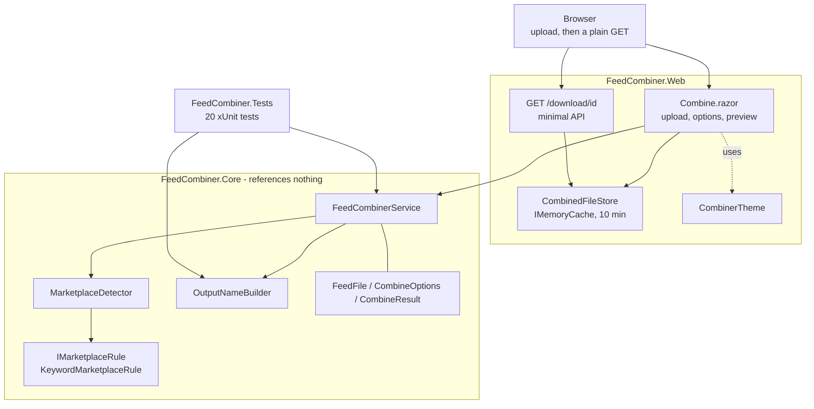

# Architecture

How Text Feed Combiner is put together, and why it is arranged this way.

This app exists to demonstrate one thing: **taking procedural code with no seams in
it and giving it seams.** The architecture is the point, not scaffolding around a
feature.

## Shape of the solution

Three projects — the only app in this portfolio with a test project.

| Project | Type | Responsibility |
|---|---|---|
| `FeedCombiner.Core` | class library | The whole domain: combining, deduping, marketplace detection, output naming |
| `FeedCombiner.Web` | `Microsoft.NET.Sdk.Web` | Blazor Server UI, the download endpoint, the short-lived file store |
| `FeedCombiner.Tests` | xUnit test project | 20 tests over `FeedCombiner.Core` |

References point **one way only**: Web → Core, Tests → Core. **`FeedCombiner.Core`
references nothing** — not ASP.NET, not Windows Forms, not `System.IO`.

That last point is the design. The domain never touches the file system or the
browser, which is exactly what makes it testable.

## How it fits together



## The rewrite this app is about

The original **MicroCombiner** was 95 lines of WinForms with every decision inside one
drag-and-drop handler — marketplace detection, output naming, dedupe and file writing,
interleaved with UI calls. Nothing in it could be reused, and nothing could be tested
without dropping files onto a form.

The same behavior, given seams:

| Type | Responsibility |
|---|---|
| `FeedFile` | One file: a name and its lines. Nothing about where it came from |
| `IMarketplaceRule` | Recognizes one marketplace from a file name |
| `KeywordMarketplaceRule` | The keyword implementation |
| `MarketplaceDetector` | Runs the rules in order, falls back to a default binder name |
| `OutputNameBuilder` | Builds the output file name |
| `FeedCombinerService` | Combines and dedupes, returns a result |
| `CombineOptions` / `CombineResult` | Inputs and outputs, as data |

**The if/else chain became a list of rules.** Adding Walmart was one entry in
`MarketplaceDetector.Default()`, not another branch:

```csharp
public static IReadOnlyList<IMarketplaceRule> Default() => new List<IMarketplaceRule>
{
    new KeywordMarketplaceRule("Amazon", "AMAZON"),
    new KeywordMarketplaceRule("Shopify", "SHOPIFY"),
    new KeywordMarketplaceRule("eBay", "EBAY"),
    new KeywordMarketplaceRule("Walmart", "WALMART")
};
```

**The options became explicit.** `CombineOptions` names four choices the original made
silently — remove duplicates, treat the first line as a header, skip blanks, trim line
ends. Each is separately testable.

**The result became data.** The original reported success with a commented-out message
box. `CombineResult` carries the output name, the lines, and counts of files
processed, lines read, duplicates removed and blanks skipped — so the UI can show them
and a test can assert them.

## Dependency injection

The domain classes are registered as singletons in `Program.cs`, which is only
possible because they are stateless and hold no dependencies on anything hosted:

```csharp
builder.Services.AddSingleton(_ => new MarketplaceDetector());
builder.Services.AddSingleton<OutputNameBuilder>();
builder.Services.AddSingleton<FeedCombinerService>();
```

`MarketplaceDetector` takes an optional rule list, so a caller — or a test — can supply
its own set instead of the defaults.

## The HTTP API

There is exactly **one** endpoint, a minimal API registered in `Program.cs`. It is
documented here rather than in a separate `api.md`, because one endpoint does not fill
a file.

### `GET /download/{id}`

Serves a previously combined file.

| | |
|---|---|
| Route | `/download/{id}` |
| Method | `GET` |
| Auth | None — the app has no authentication |
| `id` | Route parameter. A 32-character hex GUID issued by `CombinedFileStore.Put` |

**Responses**

| Status | Body | When |
|---|---|---|
| `200 OK` | The file, `Content-Type: text/plain`, with a download filename | The id is in the store and has not expired |
| `404 Not Found` | `"That download has expired. Combine the files again."` | Unknown or expired id |

**Example**

```
GET /download/9f2a4c1e8b7d4f0a9c3e5d1b6a8f2e4c

200 OK
Content-Type: text/plain
Content-Disposition: attachment; filename=WP-2026-Binder_AMAZON.txt

sku	title	price
WP-1G-BLK	1-Gang Blank Wall Plate	2.19
```

Verified against the running app: an unknown id returns the 404 message above rather
than an error page.

**There is no Swagger/OpenAPI**, and adding it would be noise — one anonymous endpoint
returning a file is fully described by the table above. No Swashbuckle package is
referenced.

### Why the store exists

A download is a plain HTTP GET, and **a GET is a separate request from the Blazor
circuit that produced the result** — so the endpoint cannot read the result out of the
component. `CombinedFileStore` bridges the two: the component parks the finished file
under a short id, the page renders an ordinary `<a href="/download/{id}">`, and the
endpoint looks it up.

```csharp
private static readonly TimeSpan Lifetime = TimeSpan.FromMinutes(10);
```

Backed by `IMemoryCache`, so entries expire on their own and nothing accumulates. An
expired link returns the 404 above.

**This is the reason the app has no custom JavaScript.** The obvious alternative — a JS
interop call that triggers a browser download from a byte array — was not needed once
the result had a URL. The only scripts on the page are the ones the Blazor and
MudBlazor templates ship with.

## Upload limits

Enforced in `Combine.razor` before anything reaches the domain:

| Limit | Value |
|---|---|
| Files per combine | 20 |
| Per file | 5 MB |
| Total | 20 MB |

Files are read through `file.OpenReadStream(MaxFileBytes)`, which is what actually
stops an oversized upload — the count and total are checked in the component, and each
stream is bounded independently.

## Rendering model

Blazor Server, **Interactive Server** rendering applied globally. Components run on
the server; the browser holds a SignalR connection.

Uploaded content lives in server memory for the life of the operation, then in the
store for up to ten minutes. **Nothing is written to disk at any point** — which is
also the fix for one of the original's bugs, where a failed run could leave a partial
file behind because the output had already been opened for writing.

## Pages and routing

| Route | Component | Does |
|---|---|---|
| `/` | `Home.razor` | Landing page, explains the rewrite |
| `/combine` | `Combine.razor` | Upload, options, run, preview, download link |
| `/not-found` | `NotFound.razor` | Re-executed target for non-200 status codes |
| `/Error` | `Error.razor` | Unhandled exception page, non-development only |
| `/download/{id}` | *(minimal API)* | The file download — not a component |

`Components/Shared/Stat.razor` is a small presentational component for the result
counters.

## UI layer

MudBlazor 9.9.0. `CombinerTheme.cs` holds the `MudTheme`: violet, Manrope, a centered
single column with no drawer, switches instead of checkboxes, 14px radius — the airiest
of the portfolio apps, because it has one screen and one job.

`wwwroot/app.css` is **almost empty and stays that way**: one `.preview` block for the
dark result panel, plus the `#blazor-error-ui` styling. Everything else is MudBlazor.

## Testing

20 xUnit tests over `FeedCombiner.Core`, covering combining, dedupe, header handling,
blank lines, whitespace, marketplace detection and output naming. Full detail in
[testing.md](testing.md).

## What is deliberately absent

- **No database.** Apps 1–3 in this portfolio prove SQL; this one proves file handling
  and class design. There is nothing to persist — a combine is a single operation with
  a result the user takes away.
- **No authentication.** Every page is public.
- **No configuration.** There is genuinely nothing to configure — see
  [configuration.md](configuration.md).
- **No custom JavaScript.**

## Recommendations

**None of the following is implemented.**

| Recommendation | Why |
|---|---|
| Stream large files instead of reading them fully | Everything is held in memory; fine at 5 MB a file, not at 500 |
| Let the user choose the marketplace rules | Currently inferred from the first file's name only |
| A column-aware CSV mode | Dedupe is line-based, so a reordered column makes an identical row look unique |
| Remember the last-used options per browser | They reset on every visit |
| Tests over `Combine.razor` itself | The 20 tests cover the domain; the upload limits and error paths in the component are untested |

### Cleanup done while documenting

Two leftovers from before the MudBlazor restyle, both **fixed**:

1. **`wwwroot/lib/bootstrap/` was dead weight** — 16 CSS files nothing referenced.
   Deleted.
2. **`Error.razor` styled its headings with `text-danger`**, a Bootstrap class, with
   Bootstrap unlinked — so it resolved to nothing. `Error.razor` and `NotFound.razor`
   are now MudBlazor pages.

**`app.css` was kept** — both of its rules are live.
